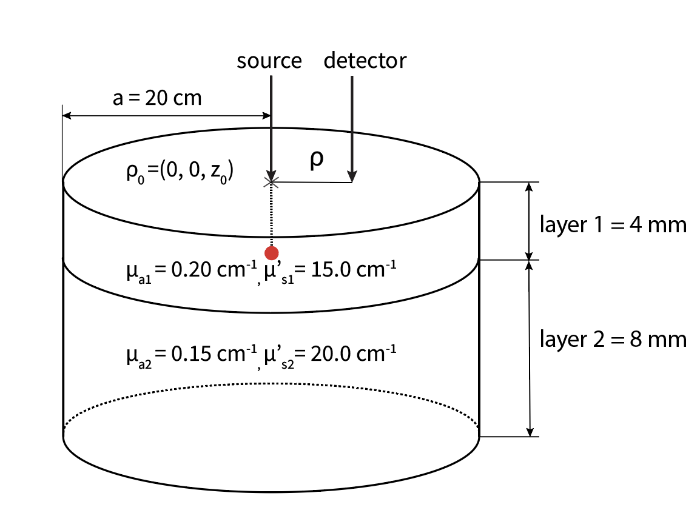
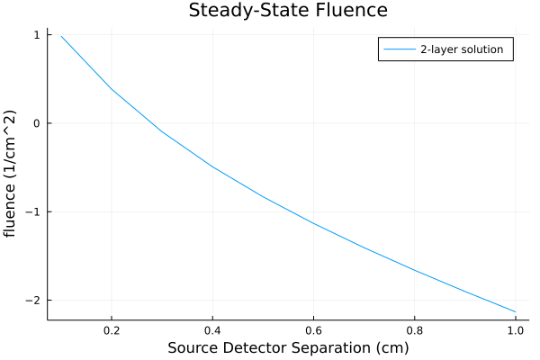
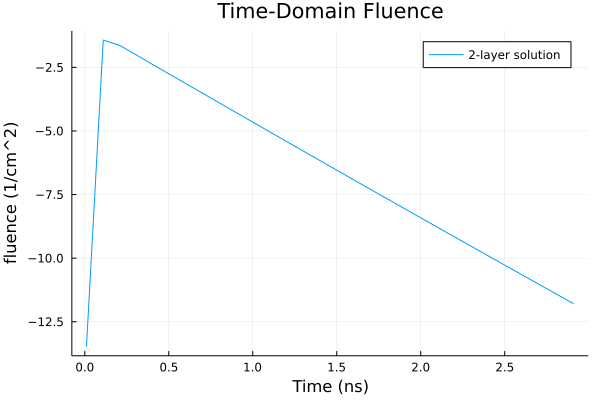
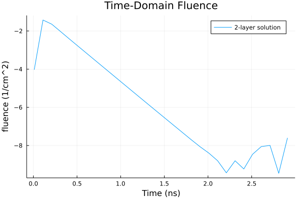
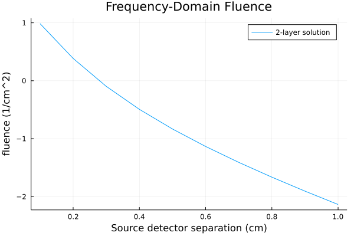
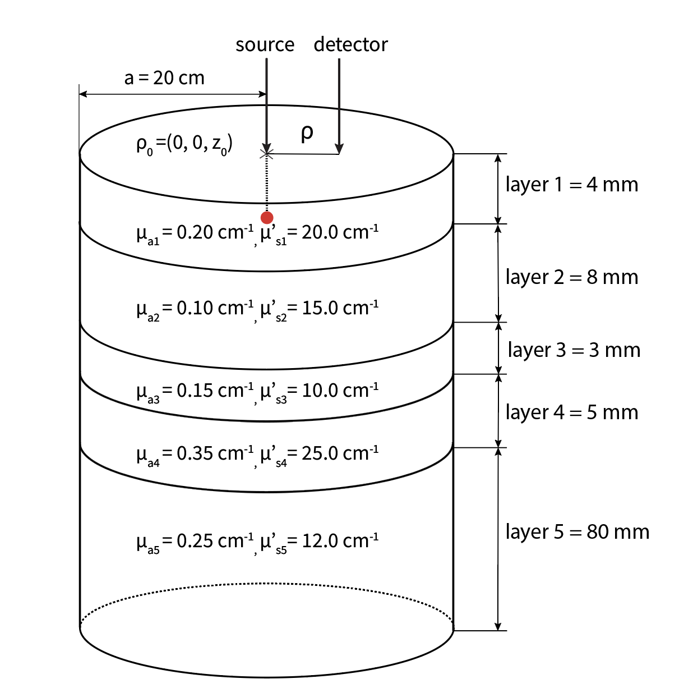
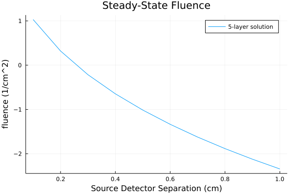

# N-layer Cylinder Examples

A major functionality of this package is the ability to perform forward modeling of the diffusion equation in arbitrarily layered media. This page will detail how to use the N-layer code including the functions `fluence_DA_Nlay_cylinder_CW`, `fluence_DA_Nlay_cylinder_TD`, and `fluence_DA_Nlay_cylinder_FD`. There are also other functions for N-layered cylinders such as `flux_DA_Nlay_cylinder_CW` that can be used in a similar manner.

## 2-Layer Example
The first example we will walk through is a simple 2-layered media. We will show how to simulate individual fluence values for the steady-state, time-domain, and frequency-domain as well as how to simulate a vector of fluence values at various times or source detector separations.

Below is a 2-layer media with example optical properties and layer thicknesses for a cylinder radius of a=20 cm. Note that for most scenarios, you will want to consider a sufficiently large radius to approximate a semi-infinite lateral geometry.



### Steady-state example
First we will go through the steady state example using the function `fluence_DA_Nlay_cylinder_CW`. This function has the following arguments including optional keyword arguments after the semicolon that default to a 2-layer medium:

```julia
fluence_DA_Nlay_cylinder_CW(ρ, μa, μsp; n_ext=1.0, n_med=(1.0, 1.0), l=(1.0, 5.0), a=10.0, z=0.0, MaxIter=10000, atol=eps(Float64))
```

The units of ρ, l, a, z are all cm, whereas μa and μsp are in cm-1 and n_ext, n_med, and MaxIter are unitless. For this example we will be ignoring the keyword arguments for MaxIter and atol which determine the number of terms to include in the summation. For detailed information on what each of these arguments are, see the docs by typing `? fluence_DA_Nlay_cylinder_CW` in your julia window.

Below are the values you would put into this function to model the two-layered media in the figure above assuming ρ = 1 cm. Notice that μa, μsp, n_med, and l all must have the same number of arguments as you want layers in the model:

```julia
julia> using LightPropagation
julia> fluence_DA_Nlay_cylinder_CW(1.0, (0.20, 0.15), (15.0, 20.0); n_ext=1.0, n_med=(1.0, 1.0), l=(0.4, 0.8), a=20.0, z=0)
0.007359921451026246
```

NOTE: It is recommended to put all arguments in decimal point form for type stability, i.e. μsp= 15.0 not 15.

We can see that our output is the fluence value at ρ=1 cm. If we wanted to simulate the fluence at multiple spatial locations to plot fluence against ρ, for example from 0 to 1.0 cm, we could simply create a range for the ρ variable as follows:

```julia
julia> ρ = 0.1:0.1:1.0
julia> cw_2lay = fluence_DA_Nlay_cylinder_CW(ρ, (0.20, 0.15), (15.0, 20.0); n_ext=1.0, n_med=(1.0, 1.0), l=(0.4, 0.8), a=20.0, z=0)
```
And then subsequently we can plot the data like so:

```julia
julia> using Plots	
julia> plot(ρ, log10.(cw_2lay), xlabel="Source Detector Separation (cm)", ylabel="fluence (1/cm^2)", title="Steady-State Fluence",label="2-layer solution")
```



### Time-domain example
We may also want to simulate light propagation through layered media in the time-domain. In order to do this we can utilize the function `fluence_DA_Nlay_cylinder_TD` which has slightly different arguments than those for the steady-state example:

```julia
fluence_DA_Nlay_cylinder_TD(t, ρ, μa, μsp; n_ext=1.0, n_med=(1.0, 1.0), l=(1.0, 5.0), a=10.0, z=0.0, MaxIter=10000, atol=eps(Float64), N, ILT)
```

In this example we will focus on the required inputs, `t, ρ, μa, and μsp`, as well as the key word arguments `n_ext, n_med, l, a, z`, and also `N` which refers to the number of terms used in the integration of the Laplace transform. For more information on what each of these arguments are, see the docs by typing `? fluence_DA_Nlay_cylinder_TD` in your julia window.

Below are the values you would put into this function to model the 2-layered media  at a single time value (i.e. 1 ns) and ρ = 1.0 cm. Notice that μa, μsp, n_med, and l all must have the same number of arguments as you want layers in the model:

```julia
julia> fluence_DA_Nlay_cylinder_TD(1.0, 1.0, (0.20, 0.15), (15.0, 20.0); n_ext=1.0, n_med=(1.0, 1.0), l=(0.4, 0.8), a=20.0, z=0)
2.2362727487107553e-5
```

We can generate the fluence at multiple time values (i.e. 0.01 to 5.0 ns), enabling a simulation of fluence vs time that we can then visualize in a plot. The reason we are explicitly defining N in this example is because we have a large ratio of the selected end time to the start time, and otherwise we would see an oscillating solution. Below is the code and plot with the defined N term of 72:

```julia
julia> t = 0.01:0.1:3.0
julia> td_2lay = fluence_DA_Nlay_cylinder_TD(t, 1.0, (0.20, 0.15), (15.0, 20.0); n_ext=1.0, n_med=(1.0, 1.0), l=(0.4, 0.8), a=20.0, z=0, N=72)
```



And here is what the plot would look like if we had not manually defined N=72 and the default was a smaller value:




### Frequency-domain example
Another modality of interest for modeling light propagation in layered media is in the frequency domain. The following example shows how you would model the same 2-layered media above for the frequency-domain using the function `fluence_DA_Nlay_cylinder_FD`, which has the following arguments:

```julia
fluence_DA_Nlay_cylinder_FD(ρ, μa, μsp; ω=1.0, n_ext=1.0, n_med=(1.0, 1.0), l=(1.0, 5.0), a=10.0, z=0.0, MaxIter=10000, atol=eps(Float64))
```

For mor information on what each specific argument refers to type `? fluence_DA_Nlay_cylinder_FD` in your julia window.

For the purposes of this example, we will focus on the required inputs `ρ, μa, μsp`, as well as a few of the key-word arguments `n_ext, n_med, l, a`. Note that the function will still work if only the main arguments are defined and the keyword arguments will default to what is shown above.

Below is the code to model the 2-layer media shown above at ρ = 1.0 cm:

```julia
julia> LightPropagation.fluence_DA_Nlay_cylinder_FD(1.0, (0.20, 0.15), (15.0, 20.0); n_ext=1.0, n_med=(1.0, 1.0), l=(0.4, 0.8), a=20.0, z=0)
0.007163897334701498 - 0.0014493145977509633im
```

Like in the steady-state domain, we can simulate the fluence at multiple SDS in order to create a plot of fluence vs SDS:

```julia
julia> ρ = 0.1:0.1:1.0
julia> fd_2lay = LightPropagation.fluence_DA_Nlay_cylinder_FD(ρ, (0.20, 0.15), (15.0, 20.0); n_ext=1.0, n_med=(1.0, 1.0), l=(0.4, 0.8), a=20.0, z=0)
```

```julia
plot(ρ, log10.(abs.(fd_2lay)), xlabel="Source detector separation (cm)", ylabel="fluence (1/cm^2)", title="Frequency-Domain Fluence",label="2-layer solution")
```




## 5-Layer Example
In some cases, we may want a highly complicated layered model, for example, to model the natural layering we see in many biological tissues such as skin, fat and muscle layers or a complex 5-layer brain model. In this section we will show an example of how to use a 5-layer model in both the steady-state and time-domain. This example with arbitrary optical properties and layer thicknesses will serve as a basis for more specific simulations that are possible using our package.

Below is a figure of the model we will be recreating in this example:



### Steady-state example
Similarly to before, we can use the function `fluence_DA_Nlay_cylinder_CW` to perform a steady-state simulation of fluence at a single source detector separation for the given model:

```julia
julia> fluence_DA_Nlay_cylinder_CW(1.0, (0.20, 0.10,0.15,0.35,0.25), (20.0, 15.0, 10.0, 25.0, 12.0); n_ext=1.0, n_med=(1.0, 1.0, 1.0, 1.0, 1.0), l=(0.4, 0.8, 0.3, 0.5, 8.0), a=20.0, z=0)
0.004532033682694147
```

Or we can simulate at multiple source detector separations and generate a plot:

```julia
julia> ρ = 0.1:0.1:1.0
julia> cw_5lay = fluence_DA_Nlay_cylinder_CW(ρ, (0.20, 0.10,0.15,0.35,0.25), (20.0, 15.0, 10.0, 25.0, 12.0); n_ext=1.0, n_med=(1.0, 1.0, 1.0, 1.0, 1.0), l=(0.4, 0.8, 0.3, 0.5, 8.0), a=20.0, z=0)
```
```julia
julia> plot(ρ, log10.(cw_5lay), xlabel="Source Detector Separation (cm)", ylabel="fluence (1/cm^2)", title="Steady-State Fluence",label="5-layer solution")
```


### Time-domain example
Once again, we can repeat the process of simulating light propagation in the 5-layered model in the time-domain using the function `fluence_DA_Nlay_cylinder_TD`. 

Below are the values you would use to model the 5-layered media above for a single time value (i.e. 1 ns) at ρ = 1.0 cm. Notice that μa, μsp, n_med, and l all have five arguments for the properties of each of the five layers:

```julia
julia> fluence_DA_Nlay_cylinder_TD(1.0, 1.0, (0.20, 0.10,0.15,0.35,0.25), (20.0, 15.0, 10.0, 25.0, 12.0); n_ext=1.0, n_med=(1.0, 1.0, 1.0, 1.0, 1.0), l=(0.4, 0.8, 0.3, 0.5, 8.0), a=20.0, z=0)
0.00010011858037953052
```

We can also simulate at multiple times in order to generate a plot of the fluence vs time:

```julia
julia> t = 0.01:0.1:3.0
julia> td_5lay = fluence_DA_Nlay_cylinder_TD(t, 1.0, (0.20, 0.15), (15.0, 20.0); n_ext=1.0, n_med=(1.0, 1.0), l=(0.4, 0.8), a=20.0, z=0, N=72)
```


